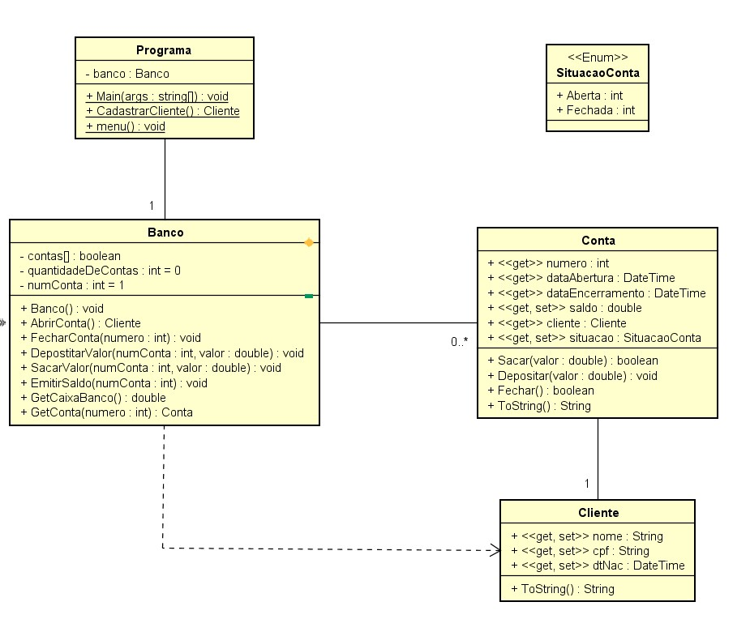

# Projeto Agência Bancária

## Objetivo da Branch

O  código apresentado nesta branch aplica os conceito de propriedades nas classes CLIENTE e CONTA. Com isso, observa-se uma sensível diminuição no código fontes dessas classes já que os métodos acessores são __auto-implementados__.

## Funcionalidades

Mesmas funcionalidades implementadas na [branch de Vetores](https://github.com/alessandrojsouza/banco_poo/tree/array_propertires).

1. Abrir Conta
2. Saldo
3. Deposito
4. Saque
5. Caixa Banco
6. Fechar Conta
7. Sair
 

## Classes Envolvidas

Atualização no modelo de classes para atender  uso de propriedades nas classes CLIENTE e CONTA.

## Referências

Documentação da Linguagem:    https://docs.microsoft.com/pt-br/dotnet/csharp/programming-guide/classes-and-structs/properties