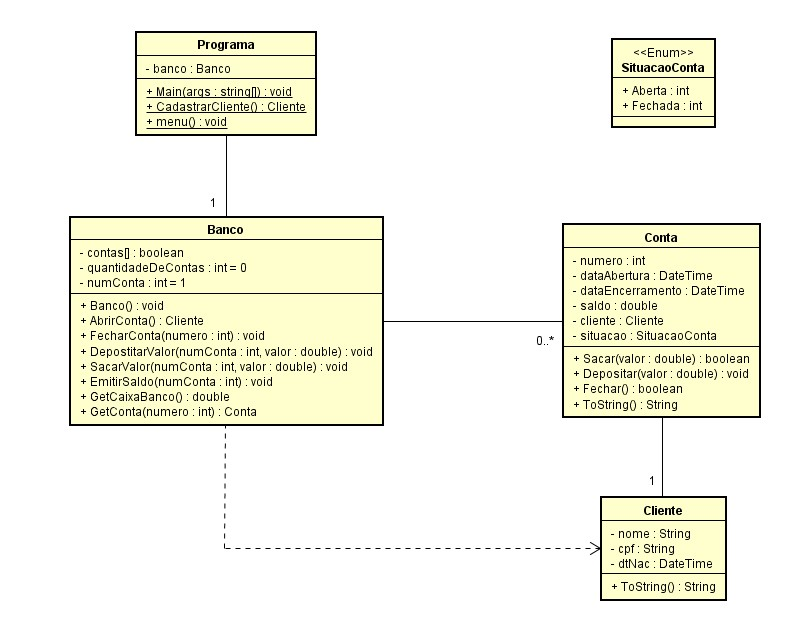

# Projeto Agência Bancária

## Objetivo da Branch
O  código apresentado nesta branch aplica os conceito de vetores para simular um banco de contas. 

Para isso cada posição do vetor vai armazenar um objeto do tipo conta, conforme se apresenta na figura abaixo. O banco pode armazenar até 100 contas, dado pelo tamanho estático do vetor.

A classe Banco que encapsula comportamentos que dão suporte ao armazenamento e manipulação das contas bancárias.

## Funcionalidades

1. Abrir Conta
2. Saldo
3. Deposito
4. Saque
5. Caixa Banco
6. Fechar Conta
7. Sair
 

## Classes Envolvidas

